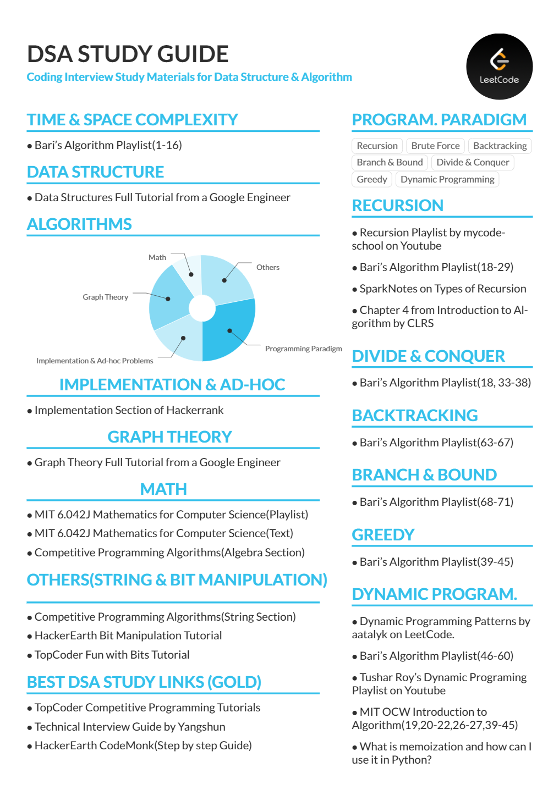

\
<https://leetcode.com/discuss/study-guide/494279/Comprehensive-Data-Structure-and-Algorithm-Study-Guide>
 
 
# Progress
### TIME & SPACE COMPLEXITY
- **Bari's Algorithm Playlist(1-16)** (16/16)(100%)
### DATA STRUCTURE
- **Data Structures Full Tutorial from a Google Engineer** (0/55)(0%)